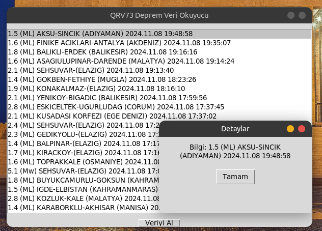

# Earthquake-data-displayer
Receives and Lists Current Earthquake Data from Kandilli Observatory as RSS. It also notifies current earthquakes with an audio alert. GUI application written in Python language can work cross-platform.
Install Git Clone and Python3

Github Package Must Be Installed On Your Device.
```bash
sudo apt install git -y
```


Python3 Package Must Be Installed On Your Device. and Required Packages

Required Packages
pip install feedparser
pip install pygame


```bash
sudo apt install python3 -y  && sudo apt install pip3 install feedparser -y && sudo apt install pip install pygame -y


```

----------------------------------
https://fatihonder.org.tr/python-ile-mors-translator-gui/

# Installation
Install cleaning
```bash
sudo git clone https://github.com/cektor/Earthquake-data-displayer.git
```
```bash
cd Earthquake-data-displayer/
```

```bash
python deprem.py
```
or

```bash
python3 deprem.py
```

# Screenshot

 
